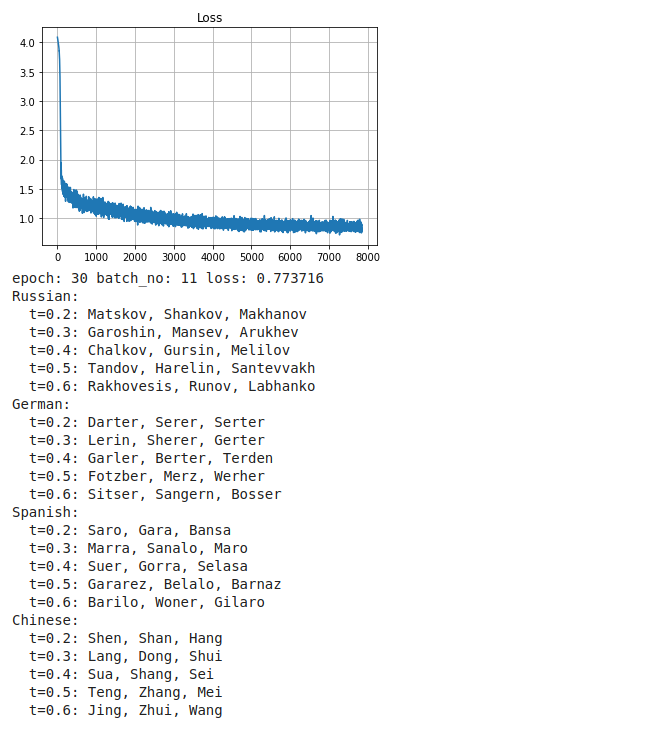

# PyTorchNameGen

LSTM-based name generator implemented in PyTorch

In the Jupyter notebook, [namegen.ipynb](namegen.ipynb), I explore how to implement, train and sample from an LSTM that is primed on some vector using PyTorch. In this case, the LSTM is trained to produce names (sequences of one-hot encoded character vectors) corresponding to the country it is primed on.

Though this is written from scratch, it is based on [this article](https://pytorch.org/tutorials/intermediate/char_rnn_generation_tutorial.html). Notable deviations from the article include:

- An LSTM is used instead of an RNN, using PyTorch's built in `nn.LSTMCell` class
- When sampling the network, characters are selected randomly according to a distribution proportional to the output probabilities of the network, rather than always greedily selecting the characters with the highest probability, resulting in more natural output. Also implemented sampling temperature.
- `<SOS>` and `<EOS>` tags are used, so that an initial character does not need to be provided
- `Adam` optimiser is used
- A data loader is implemented
- GPU acceleration + Google Colab support

